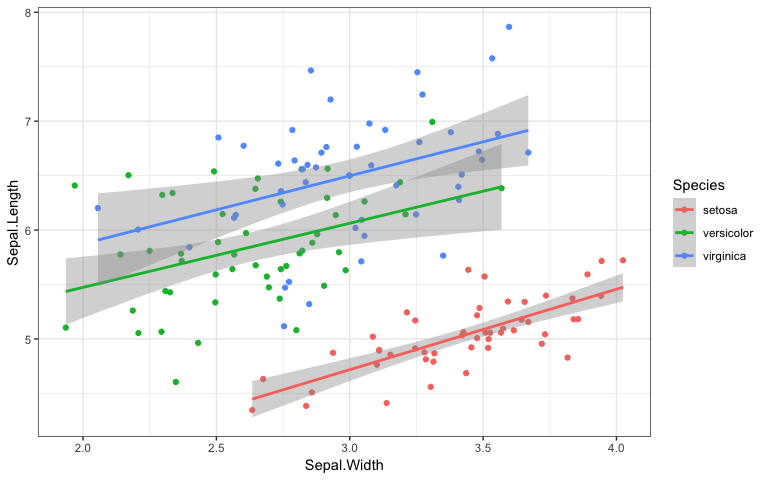

<!-- README.md is generated from README.Rmd. Please edit that file -->
<!-- badges: start -->
[](https://www.tidyverse.org/lifecycle/#experimental) <!-- badges: end -->

It is useful to be able to simulate data with a specified structure. The `faux` package provides some functions to make this process easier.

sim\_design
-----------

This function creates a dataset with a specific between- and within-subjects design. [see vignette](articles/sim_design.html)

For example, the following creates a 2w\*2b design with 100 observations in each cell. The between-subject factor is `pet` with twolevels of `cat` and `dog`. The within-subject factor is `time` with two levels of `day` and `night`. The mean for the `cat_day` cell is 10, the mean for the `cat_night` cell is 20, the mean for the `dog_day` cell is 15, and the mean for the `dog_night` cell is 25. All cells have a SD of 5 and all within-subject cells are correlated <code>r = 0.5</code>. The resulting data has exactly these values (set `empirical = FALSE` to sample from a population with these values).

``` r
between <- list("pet" = c("cat", "dog"))
within <- list("time" = c("day", "night"))
mu <- data.frame(
  cat = c(10, 20),
  dog = c(15, 25),
  row.names = within$time
)
df <- sim_design(within, between, 
                 n = 100, mu = mu, sd = 5, r = .5,
                 empirical = TRUE)
```

| pet |    n| var   |  day|  night|  mean|   sd|
|:----|----:|:------|----:|------:|-----:|----:|
| cat |  100| day   |  1.0|    0.5|    10|    5|
| cat |  100| night |  0.5|    1.0|    20|    5|
| dog |  100| day   |  1.0|    0.5|    15|    5|
| dog |  100| night |  0.5|    1.0|    25|    5|

rnorm\_multi
------------

This function makes multiple normally distributed vectors with specified parameters and relationships.[see vignette](articles/rnorm_multi.html)

For example, the following creates a sample that has 100 observations of 3 variables, drawn from a population where A has a mean of 0 and SD of 1, while B and C have means of 20 and SDs of 5. A correlates with B and C with r = 0.5, and B and C correlate with r = 0.25.

``` r

dat <- rnorm_multi(
  n = 100, 
  mu = c(0, 20, 20),
  sd = c(1, 5, 5),
  r = c(0.5, 0.5, 0.25), 
  varnames = c("A", "B", "C"),
  empirical = FALSE
)
```

|    n| var |     A|     B|     C|   mean|    sd|
|----:|:----|-----:|-----:|-----:|------:|-----:|
|  100| A   |  1.00|  0.62|  0.46|  -0.05|  1.08|
|  100| B   |  0.62|  1.00|  0.19|  19.95|  5.38|
|  100| C   |  0.46|  0.19|  1.00|  19.81|  5.15|

sim\_df
-------

This function produces a dataframe with the same distributions and correlations as an existing dataframe. It only returns numeric columns and simulates all numeric variables from a continuous normal distribution (for now). [see vignette](articles/sim_df.html)

For example, the following code creates a new sample from the built-in dataset `iris` with 50 observations of each species.

``` r
new_iris <- sim_df(iris, 50, "Species") 
```



Additional functions
--------------------

### check\_sim\_stats

If you want to check your simulated stats or just describe an existing dataset, use `check_sim_stats()`.

``` r
check_sim_stats(iris)
#> # A tibble: 4 x 8
#>       n var   Sepal.Length Sepal.Width Petal.Length Petal.Width  mean    sd
#>   <dbl> <chr>        <dbl>       <dbl>        <dbl>       <dbl> <dbl> <dbl>
#> 1   150 Sepa…         1          -0.12         0.87        0.82  5.84  0.83
#> 2   150 Sepa…        -0.12        1           -0.43       -0.37  3.06  0.44
#> 3   150 Peta…         0.87       -0.43         1           0.96  3.76  1.77
#> 4   150 Peta…         0.82       -0.37         0.96        1     1.2   0.76
```

You can also group your data and change the digits to round. Display the table using `knitr::kable()` by setting `usekable` to `TRUE` (remember to set `results='asis'` in the chunk header.

``` r
check_sim_stats(iris, 
                between = "Species", 
                digits = 3, 
                usekable = TRUE)
```

| Species    |    n| var          |  Sepal.Length|  Sepal.Width|  Petal.Length|  Petal.Width|   mean|     sd|
|:-----------|----:|:-------------|-------------:|------------:|-------------:|------------:|------:|------:|
| setosa     |   50| Sepal.Length |         1.000|        0.743|         0.267|        0.278|  5.006|  0.352|
| setosa     |   50| Sepal.Width  |         0.743|        1.000|         0.178|        0.233|  3.428|  0.379|
| setosa     |   50| Petal.Length |         0.267|        0.178|         1.000|        0.332|  1.462|  0.174|
| setosa     |   50| Petal.Width  |         0.278|        0.233|         0.332|        1.000|  0.246|  0.105|
| versicolor |   50| Sepal.Length |         1.000|        0.526|         0.754|        0.546|  5.936|  0.516|
| versicolor |   50| Sepal.Width  |         0.526|        1.000|         0.561|        0.664|  2.770|  0.314|
| versicolor |   50| Petal.Length |         0.754|        0.561|         1.000|        0.787|  4.260|  0.470|
| versicolor |   50| Petal.Width  |         0.546|        0.664|         0.787|        1.000|  1.326|  0.198|
| virginica  |   50| Sepal.Length |         1.000|        0.457|         0.864|        0.281|  6.588|  0.636|
| virginica  |   50| Sepal.Width  |         0.457|        1.000|         0.401|        0.538|  2.974|  0.322|
| virginica  |   50| Petal.Length |         0.864|        0.401|         1.000|        0.322|  5.552|  0.552|
| virginica  |   50| Petal.Width  |         0.281|        0.538|         0.322|        1.000|  2.026|  0.275|

### make\_id

It is useful for IDs for random effects (e.g., subjects or stimuli) to be character strings (so you don't accidentally include them as fixed effects) with the same length s(o you can sort them in order like S01, S02,..., S10 rather than S1, S10, S2, ...) This function returns a list of IDs that have the same string length and a specified prefix.

``` r
make_id(n = 10, prefix = "ITEM_")
#>  [1] "ITEM_01" "ITEM_02" "ITEM_03" "ITEM_04" "ITEM_05" "ITEM_06" "ITEM_07"
#>  [8] "ITEM_08" "ITEM_09" "ITEM_10"
```

### pos\_def\_limits

Not all correlation matrices are possible. For example, if variables A and B are correlated with r = 1.0, then the correlation between A and C can only be exactly equal to the correlation between B and C.

The function `pos_def_limits()` lets you know what the possible range of values is for the missing value in a correlation matrix with one missing value. The correlation values are entered just from the top right triangle of the matrix, with a single `NA` for the missing value.

``` r
lims <- pos_def_limits(.8, .2, NA)
```

|     min|    max|
|-------:|------:|
|  -0.427|  0.747|

For example, if r<sub>AB</sub> = 0.8 and r<sub>AC</sub> = 0.2, then -0.427 &lt;= r<sub>BC</sub> &lt;= 0.747.

If you enter a correlation matrix that contains impossible combinations, your limits will be `NA`.

``` r
lims <- pos_def_limits(.8, .2,  0,
                          -.5, NA,
                               .2)
```

| min | max |
|:----|:----|
| NA  | NA  |

### is\_pos\_def()

If you have a full matrix and want to know if it is positive definite, you can use the following code:

``` r
c(.2, .3, .4, .2,
      .3, -.1, .2,
           .4, .5,
               .3) %>%
  cormat_from_triangle() %>%
  is_pos_def()
#> [1] TRUE
```

``` r
matrix(c(1, .3, -.9, .2,
        .3,  1,  .4, .5,
       -.9, .4,   1, .3,
        .2, .5,  .3,  1), 4) %>%
  is_pos_def()
#> [1] FALSE
```
