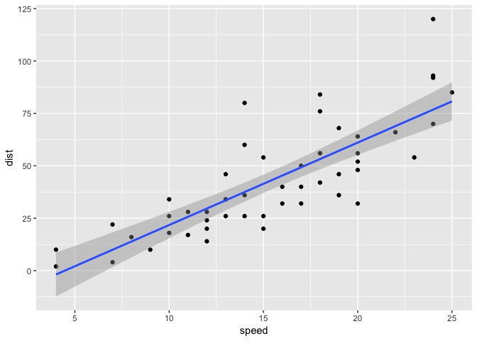
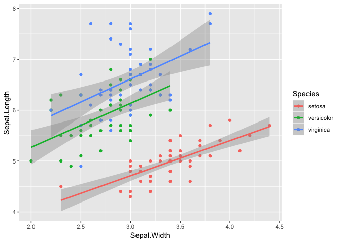
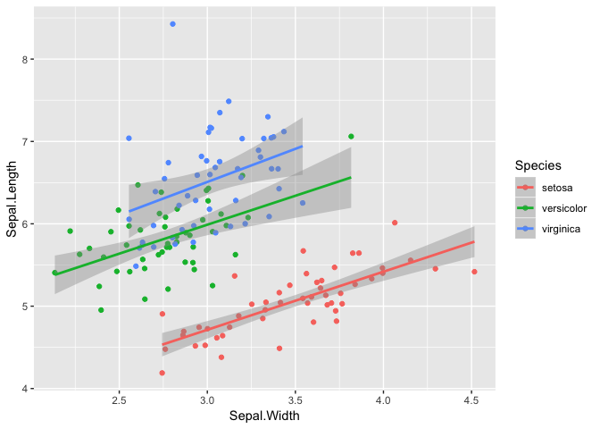

<!-- README.md is generated from README.Rmd. Please edit that file -->
faux
====

It is useful to be able to simulate data with a specified structure. The `faux` package provides some functions to make this process easier.

Installation
------------

You can install the released version of faux from [GitHub](https://github.com/debruine/faux) with:

``` r
devtools::install_github("debruine/faux")
```

Examples
--------

``` r
library(tidyverse)
library(faux)
```

### rnorm\_multi

This function makes multiple normally distributed vectors with specified parameters and relationships.

For example, the following creates a sample that has 100 observations of 3 variables, drawn from a population where where A correlates with B and C with r = 0.5, and B and C correlate with r = 0.25. A has a mean of 0 and SD of 1, while B and C have means of 20 and SDs of 5.

``` r

dat <- rnorm_multi(n = 100, 
                  cors = c(0.5, 0.5, 0.25), 
                  mu = c(0, 20, 20),
                  sd = c(1, 5, 5),
                  varnames = c("A", "B", "C"),
                  empirical = FALSE)
```

| var |     A|     B|     C|   mean|    sd|
|:----|-----:|-----:|-----:|------:|-----:|
| A   |  1.00|  0.45|  0.49|   0.03|  0.99|
| B   |  0.45|  1.00|  0.33|  20.01|  4.89|
| C   |  0.49|  0.33|  1.00|  19.76|  4.02|

#### Specify `cors`

You can specify the correlations in one of four ways:

-   A single r for all pairs
-   A vars by vars matrix
-   A vars\*vars length vector
-   A vars\*(vars-1)/2 length vector

##### One Number

If you want all the pairs to have the same correlation, just specify a single number.

``` r
bvn <- rnorm_multi(100, 5, .3, varnames = letters[1:5])
```

| var |     a|     b|     c|     d|     e|   mean|    sd|
|:----|-----:|-----:|-----:|-----:|-----:|------:|-----:|
| a   |  1.00|  0.35|  0.22|  0.45|  0.37|  -0.04|  1.09|
| b   |  0.35|  1.00|  0.19|  0.36|  0.28|  -0.05|  0.83|
| c   |  0.22|  0.19|  1.00|  0.26|  0.20|   0.01|  1.08|
| d   |  0.45|  0.36|  0.26|  1.00|  0.24|   0.00|  1.00|
| e   |  0.37|  0.28|  0.20|  0.24|  1.00|   0.04|  0.97|

##### Matrix

If you already have a correlation matrix, such as the output of `cor()`, you can specify the simulated data with that.

``` r
cmat <- cor(iris[,1:4])
bvn <- rnorm_multi(100, 4, cmat, 
                  varnames = colnames(cmat))
```

| var          |  Sepal.Length|  Sepal.Width|  Petal.Length|  Petal.Width|   mean|    sd|
|:-------------|-------------:|------------:|-------------:|------------:|------:|-----:|
| Sepal.Length |          1.00|        -0.10|          0.88|         0.83|  -0.01|  1.05|
| Sepal.Width  |         -0.10|         1.00|         -0.38|        -0.29|  -0.19|  1.09|
| Petal.Length |          0.88|        -0.38|          1.00|         0.96|  -0.01|  1.02|
| Petal.Width  |          0.83|        -0.29|          0.96|         1.00|  -0.05|  0.98|

##### Vector (vars\*vars)

You can specify your correlation matrix by hand as a vars\*vars length vector, which will include the correlations of 1 down the diagonal.

``` r
cmat <- c(1, .3, .5,
          .3, 1, 0,
          .5, 0, 1)
bvn <- rnorm_multi(100, 3, cmat, 
                  varnames = c("first", "second", "third"))
```

| var    |  first|  second|  third|   mean|    sd|
|:-------|------:|-------:|------:|------:|-----:|
| first  |   1.00|    0.33|   0.45|  -0.12|  1.01|
| second |   0.33|    1.00|  -0.04|  -0.01|  1.04|
| third  |   0.45|   -0.04|   1.00|  -0.11|  1.00|

##### Vector (vars\*(vars-1)/2)

You can specify your correlation matrix by hand as a vars\*(vars-1)/2 length vector, skipping the diagonal and lower left duplicate values.

``` r
rho1_2 <- .3
rho1_3 <- .5
rho1_4 <- .5
rho2_3 <- .2
rho2_4 <- 0
rho3_4 <- -.3
cmat <- c(rho1_2, rho1_3, rho1_4, rho2_3, rho2_4, rho3_4)
bvn <- rnorm_multi(100, 4, cmat, 
                  varnames = letters[1:4])
```

| var |     a|     b|      c|      d|   mean|    sd|
|:----|-----:|-----:|------:|------:|------:|-----:|
| a   |  1.00|  0.35|   0.55|   0.50|  -0.13|  1.01|
| b   |  0.35|  1.00|   0.16|   0.09|  -0.10|  1.05|
| c   |  0.55|  0.16|   1.00|  -0.21|  -0.19|  0.91|
| d   |  0.50|  0.09|  -0.21|   1.00|   0.12|  0.97|

#### empirical

If you want your samples to have the *exact* correlations, means, and SDs you entered, set `empirical` to TRUE.

``` r
bvn <- rnorm_multi(100, 5, .3, 
                  varnames = letters[1:5], 
                  empirical = T)
```

| var |    a|    b|    c|    d|    e|  mean|   sd|
|:----|----:|----:|----:|----:|----:|-----:|----:|
| a   |  1.0|  0.3|  0.3|  0.3|  0.3|     0|    1|
| b   |  0.3|  1.0|  0.3|  0.3|  0.3|     0|    1|
| c   |  0.3|  0.3|  1.0|  0.3|  0.3|     0|    1|
| d   |  0.3|  0.3|  0.3|  1.0|  0.3|     0|    1|
| e   |  0.3|  0.3|  0.3|  0.3|  1.0|     0|    1|

### simdf

This function produces a dataframe with the same distributions and correlations as an existing dataframe. It only returns numeric columns and simulates all numeric variables from a continuous normal distribution (for now).

For example, here is the relationship between speed and distance in the built-in dataset `cars`.

``` r
cars %>%
  ggplot(aes(speed, dist)) + 
  geom_point() +
  geom_smooth(method = "lm")
```


<p class="caption">
Original cars dataset
</p>

You can create a new sample with the same parameters and 500 rows with the code `simdf(cars, 500)`.

``` r
simdf(cars, 500) %>%
  ggplot(aes(speed, dist)) + 
    geom_point() +
    geom_smooth(method = "lm")
```


<p class="caption">
Simulated cars dataset
</p>

#### Grouping Variables

You can also optionally add grouping variables. For example, here is the relationship between sepal length and width in the built-in dataset `iris`.

``` r
iris %>%
  ggplot(aes(Sepal.Width, Sepal.Length, color = Species)) +
  geom_point() +
  geom_smooth(method = "lm")
```


<p class="caption">
Original iris dataset
</p>

And here is a new sample with 50 observations of each species, made with the code `simdf(iris, 100, "Species")`.

``` r
simdf(iris, 50, "Species") %>%
  ggplot(aes(Sepal.Width, Sepal.Length, color = Species)) +
  geom_point() +
  geom_smooth(method = "lm")
```


<p class="caption">
Simulated iris dataset
</p>

For now, the function only creates new variables sampled from a continuous normal distribution. I hope to add in other sampling distributions in the future. So you'd need to do any rounding or truncating yourself.

``` r
simdf(iris, 50, "Species") %>%
  mutate_if(is.numeric, round, 1) %>%
  ggplot(aes(Sepal.Width, Sepal.Length, color = Species)) +
  geom_point() +
  geom_smooth(method = "lm")
```


<p class="caption">
Simulated iris dataset (rounded)
</p>

### pos\_def\_limits

Not all correlation matrices are possible. For example, if variables A and B are correlated with r = 1.0, then the correlation between A and C can only be exactly equal to the correlation between B and C.

The function `pos_def_limits()` lets you know what the range of values is for a correlation matrix with one missing value. The correlation values are entered just from the top right triangle of the matrix, with a single `NA` for the missing value.

``` r
lims <- pos_def_limits(.8, .2, NA)
```

|     min|    max|
|-------:|------:|
|  -0.427|  0.747|

For example, if r<sub>AB</sub> = 0.8 and r<sub>AC</sub> = 0.2, then -0.427 &lt;= r<sub>BC</sub> &lt;= 0.747.

If you enter a correlation matrix that contains impossible combinations, your limits will be `NA`.

``` r
lims <- pos_def_limits(.8, .2,  0,
                          -.5, NA,
                               .2)
```

| min | max |
|:----|:----|
| NA  | NA  |

If you have a full matrix and want to know if it positive definite, you can use the following code:

``` r
c(.2, .3, .4, .2,
      .3, -.1, .2,
           .4, .5,
               .3) %>%
  cormat_from_triangle() %>%
  is_pos_def()
#> [1] TRUE
```

``` r
matrix(c(1, .3, -.9, .2,
        .3,  1,  .4, .5,
       -.9, .4,   1, .3,
        .2, .5,  .3,  1), 4) %>%
  is_pos_def()
#> [1] FALSE
```

### check\_sim\_stats

If you want to check your simulated stats or just describe an existing dataset, use `check_sim_stats()`.

``` r
check_sim_stats(iris)
#> # A tibble: 4 x 7
#>   var         Sepal.Length Sepal.Width Petal.Length Petal.Width  mean    sd
#>   <chr>              <dbl>       <dbl>        <dbl>       <dbl> <dbl> <dbl>
#> 1 Sepal.Leng…         1          -0.12         0.87        0.82  5.84  0.83
#> 2 Sepal.Width        -0.12        1           -0.43       -0.37  3.06  0.44
#> 3 Petal.Leng…         0.87       -0.43         1           0.96  3.76  1.77
#> 4 Petal.Width         0.82       -0.37         0.96        1     1.2   0.76
```

You can also group your data and change the digits to round. Display the table using `knitr::kable()` by setting `usekable` to `TRUE` (remember to set `results='asis'` in the chunk header.

``` r
check_sim_stats(iris, 
                grp_by = "Species", 
                digits = 3, 
                usekable = TRUE)
```

| Species    | var          |  Sepal.Length|  Sepal.Width|  Petal.Length|  Petal.Width|   mean|     sd|
|:-----------|:-------------|-------------:|------------:|-------------:|------------:|------:|------:|
| setosa     | Sepal.Length |         1.000|        0.743|         0.267|        0.278|  5.006|  0.352|
| setosa     | Sepal.Width  |         0.743|        1.000|         0.178|        0.233|  3.428|  0.379|
| setosa     | Petal.Length |         0.267|        0.178|         1.000|        0.332|  1.462|  0.174|
| setosa     | Petal.Width  |         0.278|        0.233|         0.332|        1.000|  0.246|  0.105|
| versicolor | Sepal.Length |         1.000|        0.526|         0.754|        0.546|  5.936|  0.516|
| versicolor | Sepal.Width  |         0.526|        1.000|         0.561|        0.664|  2.770|  0.314|
| versicolor | Petal.Length |         0.754|        0.561|         1.000|        0.787|  4.260|  0.470|
| versicolor | Petal.Width  |         0.546|        0.664|         0.787|        1.000|  1.326|  0.198|
| virginica  | Sepal.Length |         1.000|        0.457|         0.864|        0.281|  6.588|  0.636|
| virginica  | Sepal.Width  |         0.457|        1.000|         0.401|        0.538|  2.974|  0.322|
| virginica  | Petal.Length |         0.864|        0.401|         1.000|        0.322|  5.552|  0.552|
| virginica  | Petal.Width  |         0.281|        0.538|         0.322|        1.000|  2.026|  0.275|
