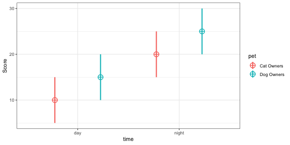
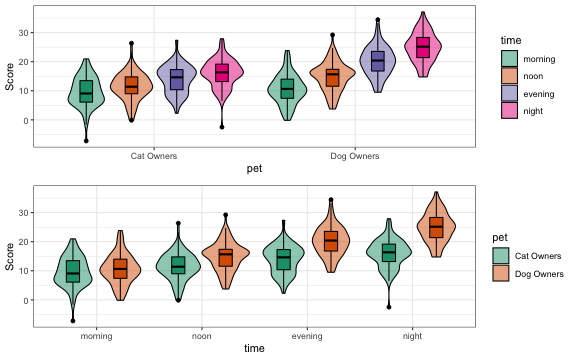

# faux 
<!-- rmarkdown v1 -->
<!-- README.md is generated from README.Rmd. Please edit that file -->

<!-- badges: start -->
[](https://zenodo.org/badge/latestdoi/163506566)
[](https://www.tidyverse.org/lifecycle/#experimental)
[](https://travis-ci.org/debruine/faux)
[](https://codecov.io/github/debruine/faux?branch=master)
<!-- badges: end -->


It is useful to be able to simulate data with a specified structure. The `faux` package provides some functions to make this process easier. See the [vignettes](articles/) for more details.

## Installation

You can install the newest version of faux from [GitHub](https://github.com/debruine/faux) with:

``` r
devtools::install_github("debruine/faux", build_vignettes = TRUE)
```

Because faux is still in early development, some features will break in future versions. Include sessioninfo::package_info() in your script to list the versions of all loaded packages.

## Quick overview

### Simulate data for a factorial design


```r
between <- list(pet = c(cat = "Cat Owners", 
                        dog = "Dog Owners"))
within <- list(time = c("morning", 
                        "noon", 
                        "evening", 
                        "night"))
mu <- data.frame(
  cat    = c(10, 12, 14, 16),
  dog    = c(10, 15, 20, 25),
  row.names = within$time
)
df <- sim_design(within, between, 
                 n = 100, mu = mu, 
                 sd = 5, r = .5)
```




```r
p1 <- plot_design(df)
p2 <- plot_design(df, "pet", "time")

cowplot::plot_grid(p1, p2, nrow = 2, align = "v")
```



### Simulate new data from an existing data table


```r
new_iris <- sim_df(iris, 50, between = "Species") 
```


